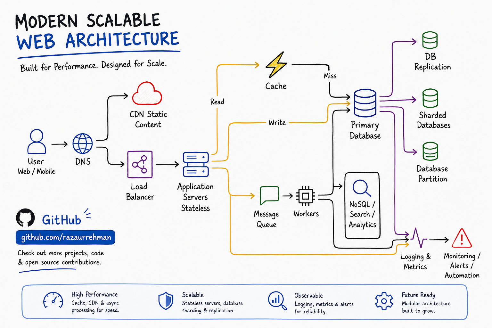

# Modern Scalable Web Architecture

**A practical reference for how production web systems are actually put together — load balancing, caching, CDNs, message queues, database sharding, and observability, with the reasoning behind each piece.**



---

## About this repo

Most system design material has one of two problems. It is either a wall of boxes with no explanation of why any of them exist, or it is a four-hour video that assumes you already know what a read replica is.

This repo sits in the middle. One diagram, and an honest explanation of what each component solves, what it costs you, and when you should not bother adding it yet.

Every layer here exists because something broke without it. That framing turns out to be the fastest way to actually learn this material.

Useful if you are preparing for system design interviews, onboarding onto a backend team, or standing at the point where your single-server app has started creaking.

---

## Contents

- [The request path](#the-request-path)
- [Component breakdown](#component-breakdown)
  - [DNS](#dns)
  - [CDN](#cdn)
  - [Load balancer](#load-balancer)
  - [Application servers](#application-servers-stateless)
  - [Cache](#cache)
  - [Primary database](#primary-database)
  - [Read replicas and replication](#read-replicas-and-replication)
  - [Sharding and partitioning](#sharding-and-partitioning)
  - [Message queue and workers](#message-queue-and-workers)
  - [NoSQL, search and analytics](#nosql-search-and-analytics)
  - [Logging, metrics and alerting](#logging-metrics-and-alerting)
- [Scaling stages](#scaling-stages)
- [Tradeoffs nobody mentions](#tradeoffs-nobody-mentions)
- [Technology choices](#technology-choices)
- [Further reading](#further-reading)

---

## The request path

Before the components, the flow. A user hits your site and this is roughly what happens:

```
User → DNS → CDN (static assets)
           → Load Balancer → App Server ─┬─ Cache hit  → return
                                         ├─ Cache miss → Database → return + populate cache
                                         └─ Message Queue → Worker (slow work, async)

Everything above emits logs and metrics → Monitoring → Alerts
```

Two paths matter most. The **read path** goes cache-first and only touches the database on a miss. The **write path** goes straight to the primary database, then invalidates or updates the cache.

Anything slow that the user does not need to wait for gets pushed onto a queue.

---

## Component breakdown

### DNS

Turns your domain into an IP address. Feels trivial until you need it for failover.

Once you run in more than one region, DNS becomes a routing tool: geo-based records send users to the nearest cluster, and health checks pull a dead region out of rotation. TTL is the tradeoff. Low TTL means fast failover and more lookups. High TTL means cheaper and stickier, but a bad deploy takes longer to route around.

**Solves:** human-readable addressing, geographic routing, coarse failover.

---

### CDN

A network of edge servers holding copies of your static assets — images, CSS, JavaScript bundles, video segments.

Without one, a user in Karachi requesting a logo waits on a round trip to a server in Virginia. That is 200ms or more for a file that has not changed in six months. The CDN serves it from a nearby edge in a fraction of that.

The catch is cache invalidation. Push a new build and the old bundle can sit at the edge for hours. The standard fix is content-hashed filenames (`app.4f2a9c.js`) so every deploy produces a new URL and stale files become unreachable rather than wrong.

**Solves:** latency for static content, bandwidth cost, origin load.
**Costs you:** an invalidation strategy you have to actually think about.

---

### Load balancer

Sits in front of your application servers and distributes incoming requests across them.

It does two jobs that get conflated. The first is spreading load so no single server becomes the bottleneck. The second is availability — health checks mean a server that stops responding gets pulled out of rotation automatically, and users never see it.

Common strategies: round robin, least connections, IP hash. Least connections tends to behave better when request duration varies a lot, which it usually does.

Layer 4 balancers route on IP and port and are fast. Layer 7 balancers read the HTTP request and can route by path or header, which is what you want when different routes go to different services.

**Solves:** horizontal scaling, zero-downtime deploys, node failure.
**Costs you:** it is now a single point of failure, so it needs redundancy too.

---

### Application servers (stateless)

The stateless part is the important word.

If a server keeps session data in local memory, a user who gets routed to a different server on their next request appears logged out. Suddenly you need sticky sessions, and sticky sessions mean you cannot freely add or remove servers.

Push all state out — sessions to Redis, files to object storage, background jobs to a queue — and your app servers become interchangeable. You can kill one mid-cycle and nothing breaks. You can add ten during a traffic spike and remove them an hour later.

This single property is what makes autoscaling, blue-green deploys, and container orchestration possible.

**Solves:** elastic scaling, safe deploys, disposable infrastructure.

---

### Cache

An in-memory store sitting between your application and your database. Redis or Memcached, usually.

Reads outnumber writes in most systems by a wide margin, and the same handful of queries tend to run constantly. Caching those means your database handles a small fraction of the traffic it otherwise would.

The pattern in the diagram is **cache-aside**: check the cache, return on a hit, and on a miss query the database, return the result, and write it into the cache for next time.

Three things to decide up front:

- **TTL** — how long before an entry expires on its own
- **Invalidation** — how you clear an entry when the underlying data changes
- **Key design** — how you namespace keys so you can invalidate a group cleanly

Cache invalidation is genuinely one of the harder problems in this diagram. Get it wrong and users see data that is quietly out of date, which is worse than slow.

**Solves:** read latency, database load.
**Costs you:** stale data windows, an extra system to run, rough cold-start behaviour after a flush.

---

### Primary database

The source of truth. All writes go here.

For most applications this should be a relational database — PostgreSQL or MySQL — and it should stay that way far longer than people expect. Modern Postgres on decent hardware handles a very large amount of traffic before it becomes the bottleneck.

Before you reach for any of the scaling components below, the cheaper wins are almost always: add the missing index, fix the N+1 query, add connection pooling, and only then think about more machines.

**Solves:** durable, consistent, queryable state.

---

### Read replicas and replication

Copies of the primary database that receive a stream of its changes. Reads get routed to replicas; writes still go to the primary.

Since most workloads are read-heavy, this buys a lot of headroom for relatively little complexity. It also gives you a failover target if the primary dies.

The tradeoff is **replication lag**. A replica is milliseconds to seconds behind. A user who writes a comment and immediately reloads may not see it, because their read landed on a replica that has not caught up. The usual fix is read-your-own-writes routing: send a user's reads to the primary for a short window after they write.

**Solves:** read scaling, redundancy, failover.
**Costs you:** eventual consistency on reads.

---

### Sharding and partitioning

Two different things that often get lumped together.

**Partitioning** splits one table across multiple pieces inside the same database, usually by date range. Old rows sit in cold partitions, recent rows stay hot, queries touch less data. This is comparatively cheap and worth doing early on large time-series tables.

**Sharding** splits your data across entirely separate database instances, each holding a subset of rows.

Sharding genuinely scales writes, which replication does not. It is also the most expensive decision in this diagram. Cross-shard joins become application-level work. Transactions across shards get hard. Rebalancing a badly chosen shard key is a migration nobody enjoys.

Do not shard until you have exhausted vertical scaling, replication, and caching. When you do, spend real time on the shard key — it is the choice you cannot easily undo.

**Solves:** write scaling, dataset size beyond one machine.
**Costs you:** query complexity, operational overhead, painful migrations.

---

### Message queue and workers

The queue accepts jobs. Workers pull jobs off and process them independently of the request cycle.

The problem it solves is straightforward. A user uploads a video that needs transcoding, thumbnails, and three notification emails. Doing that inside the HTTP request means a ninety-second wait and a likely timeout. Instead the API validates the input, drops a job on the queue, and returns immediately. A worker picks it up seconds later.

This also acts as a shock absorber. Traffic spikes fill the queue rather than knocking your servers over, and workers drain it at whatever rate they can sustain.

What you need to handle:

- **Idempotency** — jobs get retried, so processing twice must be safe
- **Dead letter queues** — jobs that keep failing need somewhere to go
- **Ordering** — most queues do not guarantee it, so design so you do not need it
- **Backpressure** — a queue growing faster than it drains is an alert, not a shrug

**Solves:** slow work, spike absorption, service decoupling.
**Costs you:** eventual consistency, harder debugging, another system to monitor.

---

### NoSQL, search and analytics

Specialised stores for workloads a relational database handles badly.

**Search** — Elasticsearch or OpenSearch. `LIKE '%query%'` does not scale and does not rank. A search engine gives you relevance, fuzzy matching, and faceting.

**Document stores** — MongoDB, DynamoDB. Genuinely useful for high-volume, schema-flexible data such as event streams, activity feeds, or session records.

**Analytics** — ClickHouse, BigQuery, Redshift. Columnar stores built for aggregating across billions of rows. Running that kind of query against your production primary is how you take down production.

The general rule: keep the source of truth relational, and project data outward into whatever store answers a specific question well.

**Solves:** full-text search, flexible schemas, heavy analytical queries.
**Costs you:** synchronisation, duplicated data, more systems.

---

### Logging, metrics and alerting

The part that gets deferred and should not be.

- **Logs** — what happened, in detail. Structured JSON, aggregated centrally, searchable. Include a request ID that flows through every service so you can reconstruct a single user's path.
- **Metrics** — numbers over time. Request rate, error rate, latency percentiles, queue depth, cache hit ratio, replication lag.
- **Traces** — the lifecycle of one request across services. This is what tells you which of nine hops ate 800ms.
- **Alerts** — automated notification when something crosses a line that matters.

Watch **p95 and p99 latency**, not averages. An average of 200ms can hide the fact that one user in twenty is waiting four seconds.

Alert on symptoms users feel — error rate up, latency up, queue draining slower than it fills — rather than on every internal number. Alerts that fire constantly get muted, and a muted alert is worse than no alert.

**Solves:** knowing what broke, and knowing before your users tell you.

---

## Scaling stages

You do not build the full diagram on day one. Roughly how it goes:

| Stage | Rough scale | What you add |
|---|---|---|
| **1. Single server** | 0 – 10k users | App and database on one box. This is fine. |
| **2. Split tier** | 10k – 100k | Database on its own machine. CDN for static assets. |
| **3. Horizontal** | 100k – 1M | Load balancer, multiple stateless app servers, Redis cache. |
| **4. Read scale** | 1M – 10M | Read replicas, queue and workers for async work, real monitoring. |
| **5. Write scale** | 10M+ | Sharding, specialised data stores, multi-region. |

Treat the numbers as rough bands, not thresholds. Write-heavy and media-heavy products hit each stage far earlier than content sites do.

The mistake that costs the most time is building stage 5 for stage 2 traffic. The second most expensive is reaching stage 4 with no observability, so you cannot tell what is actually slow.

---

## Tradeoffs nobody mentions

**Every component is a new failure mode.** Your cache can go down. Your queue can back up. Nine moving parts fail more often than one, they just fail in smaller pieces.

**Distributed systems are harder to debug.** A bug in a monolith is a stack trace. A bug across services is a correlation exercise. This is why tracing stops being optional past stage 4.

**Consistency is what you trade for speed.** Caches, replicas, and queues all buy performance by letting some part of the system be briefly wrong. Decide explicitly where that is acceptable.

**Operational cost is real cost.** Every box on this diagram needs patching, monitoring, capacity planning, and someone who understands it at 3 AM.

**Boring scales further than people think.** Postgres with good indexes, a Redis cache, and a queue will carry an enormous amount of traffic. Reach for exotic infrastructure only when you can name the specific limit you have hit.

---

## Technology choices

Common options for each layer. None of these are the only right answer.

| Layer | Options |
|---|---|
| CDN | Cloudflare, CloudFront, Fastly, Bunny |
| Load balancer | Nginx, HAProxy, AWS ALB, Traefik, Envoy |
| App runtime | Node.js, Go, Python, Java, .NET |
| Cache | Redis, Memcached, Valkey |
| Primary database | PostgreSQL, MySQL, Aurora |
| Queue | RabbitMQ, Kafka, SQS, BullMQ, NATS |
| Search | Elasticsearch, OpenSearch, Typesense, Meilisearch |
| Analytics | ClickHouse, BigQuery, Redshift, DuckDB |
| Metrics | Prometheus with Grafana, Datadog, New Relic |
| Logs | Loki, ELK stack, CloudWatch |
| Tracing | OpenTelemetry, Jaeger, Tempo |

---

## Further reading

- *Designing Data-Intensive Applications* by Martin Kleppmann. The single best book on this material.
- *Site Reliability Engineering* by Google. Free online. Strong on the observability side.
- The AWS and Google Cloud architecture centres, for reference patterns.
- Engineering blogs from teams operating at scale. They publish the failures too, which is where the value is.

---

## Repository structure

```
├── assets/
│   └── modern-scalable-web-architecture.png
├── diagrams/          # editable source files
├── examples/          # minimal reference configs
└── README.md
```

---

## Contributing

Corrections and additions are welcome, particularly:

- Real-world numbers on where each layer actually starts to matter
- Translations of the diagram
- Cases where the standard advice does not hold

Open an issue or send a pull request. Disagreeing with anything above is a good reason to open an issue — the argument is usually more useful than the diagram.

---

## License

Diagram released under CC BY 4.0. Text under MIT.

---

## Author

**Raza Ur Rehman** — Senior Full Stack Developer

[GitHub](https://github.com/Razaurrehman) · [LinkedIn](https://www.linkedin.com/in/raza-ur-rehman-0689a1146)

---

**If this helped you reason about your own system, star the repo.**
